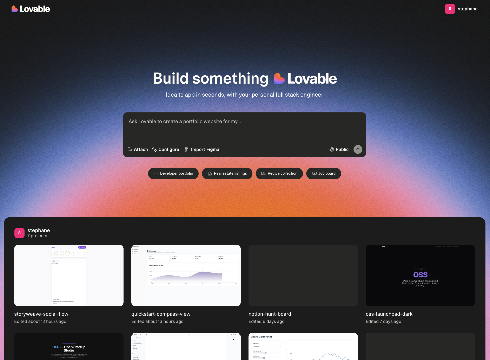

# Quickstart

Welcome to this step-by-step guide on how to create a full-stack application using Lovable:



## The Lovable Platform Overview

```
</Steps>
```

## Start your Project

There are several ways to get started with Lovable, depending on your preferences and resources:

```
</Steps>
```

```
</Steps>
[More information here.](https://www.youtube.com/watch?v=c0zhLzcVJRI)
```

```
</Steps>
[More information here.](https://www.youtube.com/watch?v=tYDqBMilHkM)
```

## Edit your Project

```
</Steps>
```

```
</Steps>
```

## Add Fullstack Capabilities to your Project

```
</Steps>
```

```
</Steps>
[More information on Supabase here.](https://docs.lovable.dev/integrations/supabase)
```

## Deploy & Publish your Project
