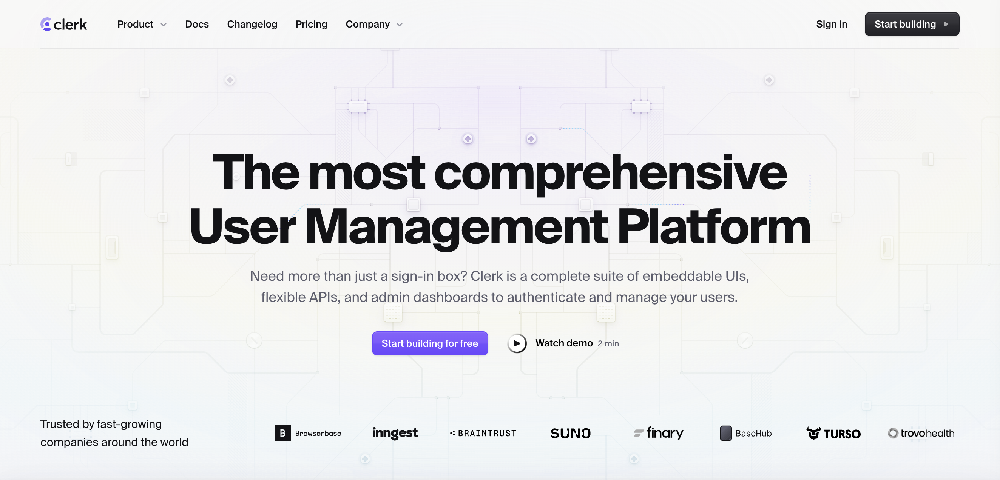

# Clerk

### Why Clerk?



[Clerk](https://clerk.com) handles authentication and user management so you don’t have to build it from scratch. With just a few prompts and config steps, you get:

* Secure sign-in & sign-up (social, password, MFA)
* Prebuilt UI components: user profiles, org management, impersonation
* Support for B2B apps (teams, roles, invitations)
* Integration with Supabase, Stripe (coming soon), and more
* Waitlist mode to manage early access
* Generous free tier: 10K MAUs

### Step-by-Step Integration Guide

Here is a step-by-step guide:

```
    </Steps>
  </Step>
  
        
      </Step>
      
      
      
    </Steps>
  </Step>
</Steps>
```

```
Use Clerk’s built-in waitlist to collect users pre-launch.


  
  
  
</Steps>
```

```
    
  </Step>
</Steps>
```

```
Troubleshoot your app as if you were a specific user.


  
  
  
</Steps>
```

```
**How to integrate:**


  
  
  </Step>
  
</Steps>
```

```
</Steps>
```

### Bonus: Build B2B Features in Minutes

Clerk supports:

* Role-based access for organizations
* Invite flows (email-based, pre-built UI)
* Organization profile customization (logo, name)
* Multi-org switching (e.g. Slack-style)

**Ask Lovable to:**

### Tips & Troubleshooting

* **Already using Supabase Auth?** You can switch to Clerk without rewriting your app logic. Just configure JWT correctly and swap auth provider.
* **Email customization:** Clerk lets you edit all transactional email templates (waitlist, invitations, approvals).
* **Mobile login**: Clerk supports passkeys, OTP, and SMS — no extra config needed in Dev Mode.
* **Compliance**: Clerk is SOC2, HIPAA, and GDPR compliant.

### Frequently Asked Questions (FAQ)

Want a question added to this FAQ? [Let us know on Discord](https://discord.gg/lovable-dev)!

### Final Thoughts

Clerk turns authentication into a prompt. You don’t need to build it yourself.

**With just a few clicks and prompts, your app now has:**

* Secure, scalable authentication
* Team & organization management
* Impersonation tools for debugging
* Supabase-backed data and access control
* Custom domain support for a polished UX
