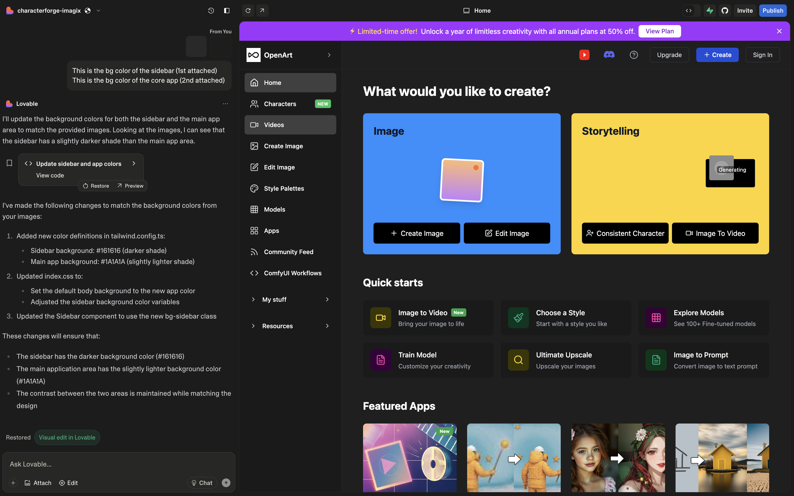

# Introduction

Lovable is an AI-powered platform that enables users of any skill level to create full-stack web applications without requiring coding expertise by simply describing what they want in plain English. Instead of hiring developers, users can generate web apps or websites instantly. - taking you **from idea to app** as fast as possible.

### Product Capabilities

The platform provides all the tools you need to create amazing websites, front-end applications as well as full-stack web applications from one browser tab - in installation required. Lovable includes AI coding tools, real-time collaboration (beta test), and project sharing to give you a head start on your app creation journey.

| Capability       | Description                                 | Maturity Level |
| ---------------- | ------------------------------------------- | -------------- |
| Frontend / UI    | Build user interfaces & frontend            | 🟢 Mature      |
| Persistence      | Store and retrieve data                     | 🟢 Mature      |
| Authentication   | Handle user login and accounts              | 🟢 Mature      |
| Backend endpoint | API key protected endpoint such as OpenAI   | 🟢 Mature      |
| Deployment       | Publish, custom domains & deploy            | 🟢 Mature      |
| Collaboration    | Collaborate with other users within project | 🟢 Mature      |
| Real-time sync   | Sync data across users in real-time         | 🟢 Mature      |

### Quick Start

To create your app on Lovable, choose the guide that matches your needs:

### What is Lovable

Lovable is an AI-powered platform that lets you create and deploy apps from a single browser tab. The platform eliminates the complexity of tradition app-creation environments by combing coding, deployment, and collaboration tools in a single interface.

Typically, you must install programs, languages, and packages to build apps. However, on Lovable, you can rely on AI to configure your environment so you can start building without coding experience.

The platform supports full-featured development and coding environments for those familiar with coding as well as those who are not, so there's no limit on what's possible.

* Complete app generation and setup from natural language description.
* Code suggestions and autocomplete.
* Automated error detection and debugging assistance.
* Documentation generation for your app.
* App deployment to the cloud in a few clicks.
* Database integration and hosting with Supabase native integration.
* Custom domain support and connection.

### Stay Connected

<table data-view="cards"><thead><tr><th></th><th></th><th data-hidden data-card-cover data-type="files"></th><th data-hidden data-card-target data-type="content-ref"></th></tr></thead><tbody><tr><td><strong>Feature Requests</strong> </td><td>Have an idea? Share it and let the community vote.!</td><td></td><td><a href="https://feedback.lovable.dev/">https://feedback.lovable.dev/</a></td></tr><tr><td><strong>Publishing documentation</strong></td><td>Publish your docs site to share with others.</td><td><a href="../.gitbook/assets/card_published_documentation.svg">card_published_documentation.svg</a></td><td><a href="broken-reference">Broken link</a></td></tr><tr><td><strong>Collaboration</strong></td><td>Invite your team and collaborate in GitBook.</td><td><a href="../.gitbook/assets/card_collaboration.svg">card_collaboration.svg</a></td><td><a href="broken-reference">Broken link</a></td></tr><tr><td><strong>Git Sync</strong></td><td>Sync with a Git repository to enable advanced workflows.</td><td><a href="../.gitbook/assets/card_git_sync.svg">card_git_sync.svg</a></td><td><a href="broken-reference">Broken link</a></td></tr><tr><td><strong>Integrations</strong></td><td>Integrate with your favorite tools and applications.</td><td><a href="../.gitbook/assets/card_integrations.svg">card_integrations.svg</a></td><td><a href="broken-reference">Broken link</a></td></tr><tr><td><strong>Account management</strong></td><td>Manage your organization, account, and billing.</td><td><a href="../.gitbook/assets/card_account_management.svg">card_account_management.svg</a></td><td><a href="broken-reference">Broken link</a></td></tr></tbody></table>

### Support

### Learn More

test
